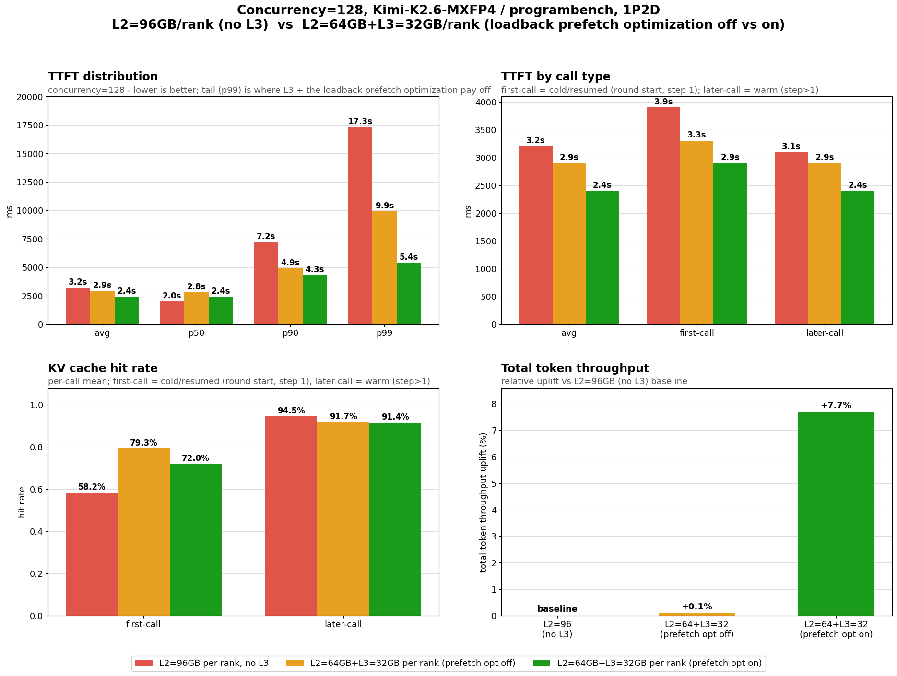
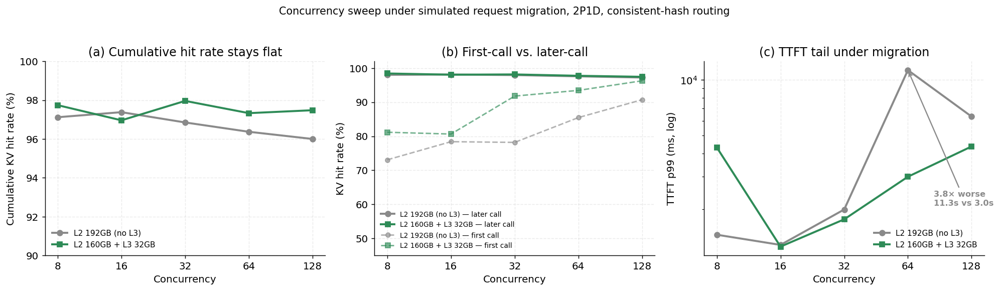

# RFC: An L3-Isolating Agentic Scenario for InferenceX

| | |
|---|---|
| **Target** | `SemiAnalysisAI/InferenceX` — `agentic-coding` scenario family |
| **Depends on** | `inferencex-agentx-mvp` scenario, `agentic_replay` timing strategy, HiCache L3 storage backends (e.g. Mooncake, NIXL, HF3FS) |
| **Discussion** | *(fork draft; not yet an upstream PR)* |

> **Status: Work in progress.** This document sets out our understanding of when
> and why an L3 KV-cache storage backend pays off, and sketches a candidate
> agentic scenario plus metric additions that would let InferenceX measure it. It
> does not change the existing `inferencex-agentx-mvp` scenario. The numbers and
> figures below are measured results included as motivating evidence —
> illustrative, not official InferenceX results.

---

## TL;DR

- An **L3 KV-cache storage backend** (a large, often shared tier below L2 host DRAM — Mooncake, NIXL, HF3FS, file stores) earns its keep whenever a prefix has aged out of L1 (HBM) and L2 (host DRAM) and is then re-entered. Its **clearest, most isolable benefit is long-gap session continuity** — an agentic session resumed after a long idle gap (a coding task picked up after lunch, a chat continued the next day), whose KV prefix is long gone from L1/L2. (Sustained high-concurrency load evicts prefixes and produces the same cold re-entry, so L3 helps there too; long-gap resumption is simply the cleanest case to model.) Without L3 that prefix is **recomputed from scratch**; with L3 it is **restored** from the cheaper capacity tier. **L3's value is the recompute it avoids** — so it must be measured against a prefix-cache-miss recompute, never against L1/L2 (which are naturally faster).
- The current `inferencex-agentx-mvp` scenario **cannot show this**: it **compresses every idle gap to 10 s** (`trace_idle_gap_cap_seconds=10.0`), so no session ever goes cold, no prefix is evicted, and the recompute-vs-restore event never happens. Its aggregator also **omits p99** and **collapses L2 and L3** into one hit-rate, so even an incidental L3 hit is invisible.
- **Cranking concurrency to force eviction into L3 is the wrong benchmark lever.** Production runs under **TTFT/TPOT SLAs**; pushing concurrency until the cache overflows breaks those SLAs and measures cache thrash. Real high load *does* evict prefixes — but a benchmark should reproduce that through **time (long gaps)** at realistic concurrency, not by overloading the cache.
- We therefore propose a **dedicated `AgentX-L3` scenario** — a new profile of the AgentX benchmark, the way `8K/1K` is a sibling scenario to `1K/1K` — that models **long-gap session resumption at realistic, SLA-respecting concurrency** and measures the resumed turn **with L3 (restore) vs without L3 (recompute)**. §4 sketches it.
- Primary metric: **resumed-turn TTFT and TPOT, against the SLA** — the recompute penalty L3 removes on cold re-entries. Secondary: L3 hit rate / restore latency and a first-call-vs-later-call split. L3 is *not* benchmarked against L1/L2 latency.

---

## 1. Background: what "L3 storage backend" means here

InferenceX's agentic scenarios exercise a multi-tier KV cache. Using SGLang HiCache terminology (see [`experimental/multiturn/README.md`](../../experimental/multiturn/README.md)):

- **L1 — GPU HBM** radix cache. Smallest, fastest, evicts first.
- **L2 — host CPU DRAM** (`--enable-hierarchical-cache`, `--hicache-ratio`). Larger, still node-local. This is where every committed SGLang agentic recipe stops today.
- **L3 — a KV *storage backend*** below L2: a distributed / capacity tier reached via `--hicache-storage-backend <mooncake|nixl|hf3fs|...>`. It can be **node-local capacity** (SSD/large DRAM pool) or, more interestingly, **cluster-shared** (a prefix offloaded by one node is fetchable by another over RDMA).

The value proposition of L3 is narrow but real: **a prefix that has fallen out of every engine's HBM (L1) and host DRAM (L2) still survives in L3, so a later re-entry fetches it instead of recomputing it.** The whole question this RFC addresses is: *under what benchmark conditions is that value visible and measurable?*

### 1.1 What the code does today

| Concern | Where | Current state |
|---|---|---|
| Scenario | `utils/aiperf/.../scenario/inferencex_agentx_mvp.py` | Locks `agentic_replay`, WEKA cc-traces, **`trace_idle_gap_cap_seconds=10.0`**, `cache_bust=first_turn_prefix`, duration ≥ 900 s. |
| Concurrency | `benchmarks/benchmark_lib.sh` (`build_replay_cmd`) | Single integer `--concurrency`; comma-list sweeps rejected under the scenario. Per **session tree**. |
| L2 (host DRAM) | `configs/*-master.yaml` `agentic-coding` + SGLang `--enable-hierarchical-cache` | Enabled in committed recipes. |
| **L3 storage backend** | `benchmarks/multi_node/amd_utils/server_sglang.sh` (`HICACHE_STORAGE_BACKEND=mooncake`) | Wired **only** in the AMD multinode SGLang server, where L3 is currently a **DRAM-backed store layered on top of L2** (additive capacity, not SSD/remote yet). Committed `srt-slurm-recipes/.../agentic/*.yaml` set **no** `--hicache-storage-backend` → **L2-only**. |
| Metrics | `utils/agentic/aggregation/` | Emits `p50/p75/p90/p95` (**no p99**). `external_cache_hit_rate := cpu_cache_hit_rate` — **L2 and L3 collapsed**. |

> **Note:** `utils/aiperf` is a **git submodule** (→ [`SemiAnalysisAI/aiperf`](https://github.com/SemiAnalysisAI/aiperf), branch `cquil11/aiperf-agentx-v1.0`), so the AgentX scenario, timing strategy, and tutorials live in that submodule; changes there land via a submodule bump (see §6).

The gap is concrete: **there is no scenario, recipe, or metric today that isolates and reports L3's value — the prefix recompute it avoids when a long-dormant session resumes.** That is what this document is about: not L3 integration itself, but the workload and metrics that would let anyone show whether an L3 backend actually pays off.

---

## 2. Motivation: why the current scenario cannot show L3 value

L3 serves one event: a session's prefix has aged out of L1 and L2 and is then re-entered — most visibly when the session resumes after a **long idle gap** (sustained high load evicts prefixes too), forcing the system to **recompute** that prefix or **restore** it from L3. `inferencex-agentx-mvp` never produces that event — and the tempting shortcut for producing it, cranking concurrency, is itself wrong.

### 2.1 The missing ingredient — long-gap dormancy

Real agentic-coding sessions are **bursty then dormant**: a developer works for a few minutes, then walks away — a meeting, lunch (**1–2 hours**), or resumes **the next day**. Over a gap that long, the session's prefix is evicted from L1 and then L2 by the passage of time and ordinary traffic turnover. When the developer returns, the (now long) prefix survives only in L3 — or, without L3, must be recomputed. **That resumption is the event L3 exists to serve.**

`inferencex-agentx-mvp` erases it: **`trace_idle_gap_cap_seconds=10.0`** compresses every recorded request-start gap over 10 s down to 10 s (`inferencex_agentx_mvp.py`; `agentx-mvp.md` §"What it locks"). A two-hour break and an overnight resume both collapse to a 10-second pause — from the server's perspective almost no time passes, so no prefix ever ages out. The MVP's steady-state design is precisely what removes the cold-tier event. **Lifting this cap — modeling the real long gaps — is the central change this document argues for.**

### 2.2 The missing comparison — L3-restore vs recompute (not L3 vs L1/L2)

L3's value is **the recomputation it avoids**, so it must be measured against the **prefix-cache-miss recompute** case: the *same* resumed turn served by an engine **without L3** (which recomputes the whole aged-out prefix) versus **with L3** (which restores it). Comparing L3's *latency* against L1/L2 is meaningless — L3 is a capacity/remote tier and is **naturally slower** than HBM or host DRAM; it is never meant to beat them. The only question is whether an L3 restore is cheaper than a full recompute — which, for a long prefix, it is by a wide margin.

The MVP cannot report even this: its aggregator **omits p99** (`utils/agentic/aggregation/request_metrics.py`) and **aliases `external_cache_hit_rate := cpu_cache_hit_rate`** (`backends/sglang.py`), collapsing L2 and L3, so an L3 restore is indistinguishable from an L2 hit and the resumed-turn tail is never surfaced.

### 2.3 The wrong shortcut — forcing L3 with high concurrency

It is tempting to provoke L3 by simply raising concurrency until the aggregate working set overflows L1+L2. **In a *benchmark*, that is the wrong lever.** Production agentic serving runs under **TTFT/TPOT SLAs**; driving concurrency past the point where the cache thrashes violates those SLAs and measures cache pressure rather than L3's value. Real high-concurrency traffic *does* evict prefixes and benefit from L3 — but a benchmark should reproduce that eviction through **long gaps at realistic, SLA-respecting concurrency**, not by deliberately overloading the cache. `AgentX-L3` therefore holds concurrency at a realistic level and induces coldness through time.

### 2.4 Summary of the gap

| L3's real use case needs… | `inferencex-agentx-mvp` provides… | Consequence |
|---|---|---|
| Long dormancy so a prefix ages out of L1/L2 | Idle gaps capped at 10 s | No cold re-entry ever occurs |
| A recompute (no-L3) baseline to compare against | No L3 arm; L2 ≡ L3 in metrics; no p99 | L3-restore vs recompute is unmeasurable |
| Realistic, SLA-bound concurrency | Forcing L3 today means overloading the cache | Manufacturing coldness breaks the TTFT/TPOT SLA |

---

## 3. Evidence: what the L3 regime looks like when you *do* provoke it

The measurements below were taken under **capacity pressure (high concurrency)** rather than long-gap dormancy — that was the data available — but they isolate exactly the mechanism `AgentX-L3` targets: a **cold / first-call re-entry** that, without L3, pays a full prefix **recompute**, and with L3 pays only an **L3 restore**. However the cold re-entry is induced — capacity pressure here, a long dormancy gap in the target scenario — the recompute-vs-restore event, and L3's effect on it, is the same. (Measured on Kimi-K2.6-MXFP4, SGLang, AMD Instinct™ MI355X.)

### 3.1 A cold re-entry served by L3 restore instead of recompute (high-concurrency proxy)

**Setup.** 1P2D, **128 concurrent** sessions — here high concurrency is only a *proxy* to force cold first-call re-entries quickly (the target scenario induces the same event via long gaps at realistic concurrency). It is also deliberately *conservative*: total DRAM is held fixed and L3 is **carved out of L2** (no extra memory — the opposite of the additional-capacity setup §4 describes). Even so, L3 wins:

| Config | L2 (per rank) | L3 (per rank) | Loadback-prefetch opt |
|---|---|---|---|
| **A** — L2-only baseline | 96 GB | — | — |
| **B** — +L3, opt off | 64 GB | 32 GB | off |
| **C** — +L3, opt on | 64 GB | 32 GB | on |

*Figure 1: Concurrency=128, 1P2D. Red = L2-only (96 GB); amber = L2 64 GB + L3 32 GB, prefetch off; green = same split, prefetch on. (a) TTFT avg/p50/p90/**p99**; (b) TTFT by call type; (c) hit rate, first-call vs later-call; (d) total-token throughput uplift.*

**Readings (A → C):**

| Metric | A (L2-only) | B (+L3, opt off) | C (+L3, opt on) | A→C |
|---|---:|---:|---:|---:|
| TTFT avg | 3.2 s | 2.9 s | 2.4 s | −25% |
| TTFT p90 | 7.2 s | 4.9 s | 4.3 s | −40% |
| **TTFT p99** | **17.3 s** | **9.9 s** | **5.4 s** | **3.2× better** |
| First-call hit rate | 58.2% | 79.3% | 72.0% | +13.8 pts |
| Later-call hit rate | 94.5% | 91.7% | 91.4% | −3.1 pts |
| **Cumulative hit rate** | **88.5%** | 88.3% | **87.5%** | **−1.0 pt** |
| Total-token throughput | baseline | +0.1% | **+7.7%** | +7.7% |

**The key insight for benchmark design:** cumulative hit rate *falls* by a point, yet the resumed-turn (first-call) TTFT tail improves **3.2× at p99** and throughput rises **+7.7%**. L3's mechanism is to lift **first-call (cold/resumed)** hits by ~14–21 points — turning cold prefix **recomputes** into bounded **L3 restores**. **A benchmark that reports only aggregate hit rate would score this as a *regression*.** Only a resumed-turn p90/p99 + first-call-vs-later-call view reveals it — which dictates §5's metrics. (And since L3 here is *carved out of* L2 at high concurrency — the conservative case — L3 as additional capacity at realistic concurrency, per §4.1, only does better.)

### 3.2 Large-scale deployment: L3 caps the migration-induced tail

**Setup.** 2P1D, consistent-hash routing, a request switched to a different prefill worker every 32k tokens of context growth — simulating **reboots, autoscaling, and request re-bucketing** in a large fleet. L2-only (192 GB) vs shared L2+L3 splits, swept over concurrency.

*Figure 2: Concurrency sweep under simulated request migration, 2P1D. (a) Cumulative hit rate is a wash (~96–98%). (b) Later-call hit is identical; **first-call hit is 2–14 points higher with L3** at every concurrency. (c) TTFT p99 (log): L2-only is **3.8× worse at concurrency 64 (11.3 s vs 3.0 s)** and 1.4× worse at 128 (6.3 s vs 4.4 s).*

**Insight:** this is a direct instance of the target event — a **cold re-entry**. The migrated request's prefix is absent from the new worker's L1/L2, so **without L3 it is recomputed; with a shared L3 it is restored**, capping the TTFT tail migration otherwise causes. Again invisible to cumulative hit rate; visible only at the resumed-turn p99 and in the first-call split. Migration is a first-class variant of `AgentX-L3` (§4.6).

---

## 4. A dedicated scenario: `AgentX-L3`

`AgentX-L3` is a **new scenario in the AgentX benchmark family — what `8K/1K` is to `1K/1K`** for the fixed-sequence-length benchmark: a named, reproducible agentic-coding scenario whose defining feature is **long-gap session continuity**. It reuses the existing pipeline (`agentic_replay`, WEKA loaders, `benchmark_lib.sh`, the `agentic-coding` master-config search space, srt-slurm recipes) and changes only what is needed to *produce* — and *measure* — cold session resumption.

### 4.1 Design principles

1. **Induce coldness through time, at realistic load.** Sessions go dormant for realistic long gaps (post-lunch, next-day) so their prefixes age out of L1/L2; concurrency stays at **realistic, SLA-respecting** levels rather than being cranked to force eviction (§2.3). (Real high load also evicts prefixes — the scenario simply doesn't rely on overload to do it.)
2. **L3 is measured against recompute.** The two arms are the *same* workload served **without L3** (a resumed prefix is recomputed) and **with L3** (it is restored). The reported win is the recompute avoided. L3 is *not* compared against L1/L2 latency — it is a capacity tier and is expected to be slower than both.
3. **L3 is additional capacity, not a re-split of DRAM.** L2 is held **fixed** at a realistic per-node budget across both arms; the L3 arm adds an L3 tier (SSD, remote, or shared pool) on top. The win is the extra tier, not a memory-budget change.
4. **Respect the SLA.** Report **TTFT and TPOT** against the SLA target; a run whose baseline already violates the SLA (e.g. from excessive concurrency) is not a valid `AgentX-L3` submission.

### 4.2 What the scenario locks

Following the `agentx-mvp` idiom, `--scenario inferencex-agentx-l3` would lock:

| Locked setting | Value | Why |
|---|---|---|
| `timing_mode` | `agentic_replay` | Same replay discipline as MVP. |
| **Idle-gap / dormancy model** | **Long gaps preserved** (replaces the flat 10 s cap) via a bounded dormancy schedule (§4.3) | Produces genuine cold re-entry — the core change. |
| Loader | WEKA cc-traces (long-gap-preserving) **or** a new long-gap corpus (§4.4) | Reproducible, hash-verifiable corpus. |
| `cache_bust` | `first_turn_prefix` | Prevents hit-rate inflation across recycles (unchanged from MVP). |
| **Comparison arms** | **without-L3 (recompute) vs with-L3 (restore)**, same **fixed L2** in both | L3's value = the recompute it avoids (§4.1). |
| **Concurrency** | a **realistic, SLA-bound** level (reported, not maximized) | L3 must pay off without breaking the SLA (§2.3). |
| Duration | ≥ 900 s (default 1800 s), same as MVP | Enough resumptions for stable percentiles. |
| Metrics | **resumed-turn TTFT/TPOT vs SLA; p90/p99; L2/L3 hit-rate split; L3 restore latency** (§5) | Makes the recompute-vs-restore win observable. |
| `random_seed` | set/logged | Reproducibility. |

### 4.3 The dormancy model (the core mechanism)

The one thing `AgentX-L3` must add is **long dormancy**: a session pauses long enough that its prefix leaves L1/L2, then resumes. It replaces the flat `trace_idle_gap_cap_seconds` with a **dormancy schedule** drawn from a realistic long-tail of gaps (minutes → hours → next-day), so a fraction of turns become genuine cold resumptions.

The practical constraint is wall-clock: a benchmark cannot idle for real hours. Coldness is therefore induced by making the gap exceed the cache's **residency/TTL**, not by waiting it out and not by overloading the cache — e.g. a bounded `dormancy_time_scale` together with a realistic L1/L2 TTL, so a "next-day" gap deterministically evicts the prefix while the run stays bounded and concurrency stays realistic. The exact mechanism is an open question (§7); what matters is that the **resumed turn is a true cold re-entry**, served by an L3 restore (treatment) or a recompute (baseline).

### 4.4 Dataset / workload

Via the existing loader machinery (`utils/aiperf/src/aiperf/dataset/loader/`, `plugins.yaml`):

1. **Existing WEKA cc-traces, long gaps preserved.** The traces already carry long inter-turn gaps; `AgentX-L3` simply stops compressing them. No new corpus required.
2. **A new long-gap corpus** (recommended for fidelity): traces selected/synthesized for **long dormancy gaps and large per-session context**, published as `semianalysisai/cc-traces-weka-longgap-<date>` and registered like the existing `semianalysis_cc_traces_weka_*` entries — a pure metadata + loader addition (§6).

### 4.5 Validity guard — a genuine cold re-entry actually happened

The scenario should **certify only if real cold resumptions occurred and were served by L3.** At validation time, check that the run produced dormant-then-resumed turns whose prefix had left L1/L2 (**L2 eviction of the resumed prefix**) and that the with-L3 arm served them from L3 (**L3 read count > 0** on those turns); otherwise stamp `submission_valid=false` (`no_cold_reentry` / `l3_not_exercised`). Combined with §4.1(4), this blocks both failure modes: "gaps too short, nothing went cold" *and* "coldness manufactured by SLA-breaking overload."

### 4.6 Large-scale-deployment variant — request migration

A second, equally realistic source of cold re-entry is **request migration**: in a large fleet, reboots, autoscaling, and consistent-hash re-bucketing move a session to a worker that does not hold its prefix in L1/L2. That worker must recompute — unless a **shared** L3 lets it restore the prefix another node offloaded. An optional `migrate_every_tokens` knob (e.g. 32k) exercises this and is the most direct demonstration of a *shared* (vs node-local) L3 (see §3.2).

---

## 5. Metrics

Primary and secondary metrics for `AgentX-L3`. Items marked **(new)** require aggregator changes (§6). The object of measurement is the **resumed (cold) turn**: with L3 it is an L3 restore, without L3 it is a full prefix recompute.

| Metric | Role | Notes |
|---|---|---|
| **Resumed-turn TTFT** (avg + p90/p99) | **Primary** | The recompute penalty L3 removes. Reported for the with-L3 and without-L3 (recompute) arms; the delta is the L3 win. p99 is **(new)** for the agentic aggregator. |
| **Resumed-turn TPOT** | **Primary** | Decode-side SLA; must hold in both arms. |
| **SLA attainment** (TTFT/TPOT within target) | **Primary** | A run whose baseline already misses SLA is invalid (§4.1(4)). |
| **First-call vs later-call** split | **Primary** | "First-call" = the cold/resumed turn (post-dormancy / post-migration); "later-call" = warm follow-ups. Isolates the cold event from steady-state. |
| **L3 hit rate & L3 restore latency** | Secondary (new) | Split today's collapsed `external_cache_hit_rate` into distinct L2 vs L3 rates; report L3 restore latency — the cost L3 trades for the avoided recompute (expected to exceed L2; that is fine). |
| Throughput (tok/s/chip), TCO / Mtok | Secondary | Reported for both arms; TCO must charge the **extra** L3 capacity. |
| L2 eviction / L3 read counts on resumed turns | Validity | Feeds the §4.5 guard. |

**What we do *not* do:** we do not compare L3 latency against L1/L2 (L3 is a slower capacity tier by construction), and we do not chase aggregate cache-hit rate (L3's win concentrates in the cold resumed turns, not the average).

**Reporting rule (fairness, MLPerf-style).** An `AgentX-L3` submission reports **both arms — without-L3 (recompute) and with-L3 (restore) — at the same realistic concurrency and the same fixed L2**, plus the resumed-turn TTFT/TPOT delta and SLA attainment. A with-L3 point without its without-L3 recompute baseline is not a valid L3 claim.

---

## 6. Implementation sketch (for a follow-up PR; no code in this RFC)

This RFC is design-only. A subsequent implementation PR would touch:

1. **Scenario** — new `utils/aiperf/src/aiperf/common/scenario/inferencex_agentx_l3.py` (`ScenarioSpec`), registered in `registry.py` / `plugins.yaml`, with the dormancy model replacing the flat idle-gap cap.
2. **Timing strategy** — extend `agentic_replay.py` with the dormancy schedule (§4.3) and the optional migration mode (§4.6), gated so `agentx-mvp` behavior is unchanged.
3. **Dataset** — optional new `plugins.yaml` corpus entry + loader for the long-gap dataset (§4.4); build tooling in `utils/agentic/datasets/`.
4. **Launch / recipes** — enable `--hicache-storage-backend` in new `srt-slurm-recipes/.../agentic/*-l3.yaml`; extend `configs/*-master.yaml` `agentic-coding` search-space with L2-only-baseline vs L2+additional-L3 pairs; `benchmark_lib.sh` / `server_sglang.sh` already carry the plumbing.
5. **Metrics** — in `utils/agentic/aggregation/`: emit **p99**; split **L2 vs L3** hit rate (stop aliasing `external_cache_hit_rate := cpu_cache_hit_rate`); add **L3 restore latency**, **L2 eviction volume**, **L3 read count**; wire the §4.5 validity guard.
6. **Docs** — an `agentx-l3` tutorial mirroring `agentx-mvp.md`, plus the mandatory `_zh.md` bilingual counterparts for any contributor-facing doc (per `AGENTS.md`).

> Items 1–3 land in the **`utils/aiperf` submodule** (→ `SemiAnalysisAI/aiperf`) and reach InferenceX via a submodule bump. Items 4–6 are in-tree.

### Suggested phasing

- **Phase 1 — Observability first.** Add p99 + L2/L3 hit-rate split + L3 restore latency to the aggregator, and enable an L3 backend in one existing agentic recipe. This alone lets us *see* whether current runs touch L3 (we expect: barely).
- **Phase 2 — The regime.** Land the long-gap dormancy model and the cold-re-entry validity guard; validate that resumed-turn TTFT and L3 reads behave as designed.
- **Phase 3 — Scale & fairness.** Add the migration variant, the recompute-baseline reporting rule, `submission_valid` for `AgentX-L3`, and the long-gap corpus.

---

## 7. Open questions

1. **Inducing coldness within a bounded run.** A real next-day gap cannot be waited out. Is TTL/residency-based eviction (gap > L1/L2 TTL) plus a bounded `dormancy_time_scale` faithful enough, and how do we set the TTL so eviction mirrors production traffic turnover rather than an artificial timer?
2. **Wall-clock budget.** How long must a run be for enough cold resumptions to accumulate stable p90/p99, and what is the acceptable duration ceiling?
3. **Node-local vs shared L3.** Should the flagship configuration require a *shared* L3 (the migration case, §4.6), where L3's routability is the whole point, or also certify node-local capacity L3?
4. **Cross-engine parity.** SGLang HiCache exposes the tiers cleanly; vLLM connectors (Mooncake/LMCache) and TRT-LLM differ. Do we define `AgentX-L3` per-engine, or hold a portable subset?
5. **Realistic concurrency & SLA target.** What concurrency and TTFT/TPOT SLA define a valid run on each hardware class — high enough to be representative, low enough that the baseline meets SLA and the win is attributable to L3 on cold turns, not to relieved cache thrash?
6. **TCO normalization.** How do we fairly charge shared-L3 capacity amortized across a fleet, vs node-local DRAM, in TCO/Mtok?

---

## 8. Non-goals

- Not changing `inferencex-agentx-mvp` or any current published result.
- **Not a concurrency / cache-thrash stress test** — coldness comes from time (long gaps) at realistic, SLA-bound load, not from overloading the cache (§2.3).
- Not proposing a specific L3 vendor/backend as canonical — Mooncake, NIXL, HF3FS, and file stores are all in scope; the scenario measures the *tier*, not a product.
- Not a model-quality benchmark — accuracy stays the domain of KVV/K2VV and the eval path.

---

## 9. References

- `inferencex-agentx-mvp` methodology — `utils/aiperf/docs/tutorials/agentx-mvp.md` (in the `utils/aiperf` submodule → [aiperf@cquil11/aiperf-agentx-v1.0](https://github.com/SemiAnalysisAI/aiperf/blob/cquil11/aiperf-agentx-v1.0/docs/tutorials/agentx-mvp.md))
- WEKA trace format & SPAWN/JOIN — `utils/aiperf/docs/tutorials/weka-trace.md` (in the `utils/aiperf` submodule → [aiperf@cquil11/aiperf-agentx-v1.0](https://github.com/SemiAnalysisAI/aiperf/blob/cquil11/aiperf-agentx-v1.0/docs/tutorials/weka-trace.md))
- Agentic single-node launchers & DRAM budget policy — [`benchmarks/single_node/agentic/README.md`](../../benchmarks/single_node/agentic/README.md)
- HiCache L1/L2 terminology & literature — [`experimental/multiturn/README.md`](../../experimental/multiturn/README.md)
- AgentX fairness precedent (MLPerf-style workload rules) — [`golden_al_distribution/README.md`](../../golden_al_distribution/README.md)
- L3 storage backend wiring (AMD multinode agentic path — `trace_replay.sh` and the agentic `benchmark_lib.sh` replay helpers land with the agentic branches, not yet on `main`) — `benchmarks/multi_node/amd_utils/server_sglang.sh`, `benchmarks/multi_node/amd_utils/trace_replay.sh`
- SGLang HiCache storage-backend integration — [sgl-project/sglang#25377](https://github.com/sgl-project/sglang/pull/25377)
